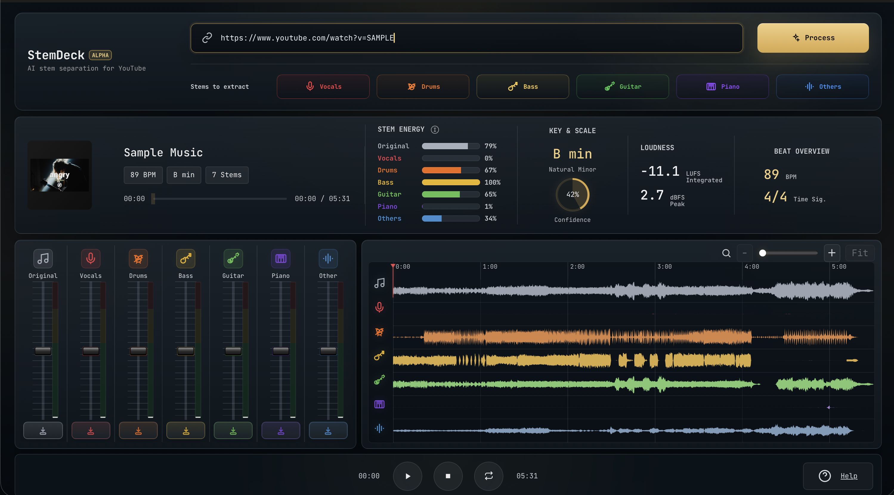

# StemDeck

If you like StemDeck and find it useful, consider [tipping the maker](https://buymeacoffee.com/tha.les), these will always go to random acts of kindness towards others.



Paste a YouTube URL, get the audio split into stems (vocals / drums / bass / guitar / piano / other) and play them back in a DAW-style multitrack mixer. Mute, solo, mix, zoom the waveform, loop a region, and download individual stems or a custom mix.

Local-only, single-user. One Python process serves both the REST/SSE API and the static frontend.

> **What is this?** StemDeck is meant to be an open, free, simplified alternative to commercial stem-splitter products like Moises, LALAL.AI, and similar tools. It runs entirely on your own machine, with no account, no quota, no upload, and no subscription. Source-available so you can read, fork, or self-host it. It is not trying to match those products feature-for-feature; it covers the basics well and stops there.

### Honest comparison

| | StemDeck | Moises / LALAL.AI / similar |
| --- | --- | --- |
| Price | Free | Freemium or pay-per-use |
| Hosting | Runs locally on your machine | Cloud, upload required |
| Account / login | None | Required |
| Stem model | Demucs `htdemucs_6s` (6 stems) | Proprietary, often higher quality |
| Polish | Functional, hobby-grade UI | Polished apps (web + mobile) |
| Extra features (pitch shift, chord detection, click track, lyrics, BPM tap, mobile apps, cloud library) | No | Yes |
| Privacy | Audio never leaves your machine | Audio uploaded to a third party |
| Source code | Available, modifiable | Closed |

If you need the polish, the mobile app, or the extra musician-facing tooling, the commercial products are a better fit and worth the money. If you mainly want stems for personal study and prefer to keep things local and free, StemDeck should be enough.

## Features

- **6-stem separation** via Demucs `htdemucs_6s`. Auto-detects the best Torch device (CUDA, MPS, CPU); on Apple Silicon you get ~3-5× speedup over CPU for free.
- **DAW-style waveform editor.** Min/max sample rendering across all stems with shared global normalization, zoom in / out / Fit (`+` / `−` / `Cmd-wheel`), loop drag on the ruler, gold playhead overlay, and stem-aligned lanes.
- **Stem subset extraction.** Click stem chips on the import page to pick which stems to keep. Filter-chip semantics: clicking from "all selected" snaps to "only this one"; subsequent clicks add or remove. Selection persists in `localStorage`.
- **"Original" backing track.** When you pick a subset, the studio includes a 7th lane with the *complement* (full song minus the selected stems). Playing it alongside the isolated stems reconstructs the full mix without doubling, which is perfect for A/B reference.
- **Downloadable selected mix.** A single `mix.wav` of just the selected stems, summed via ffmpeg amix. Surfaces as the **Download Mix** button in the footer.
- **Per-stem mixer.** Volume fader, mute, solo, and "monitor" (solo-only) per stem. State is synced between the preview mixer and the stems sidebar.
- **Live VU per stem.** Post-gain RMS via Web Audio analysers on each stem's gain node. Peak hold + slow falloff for the classic DAW meter feel.
- **Song analysis.** BPM (librosa beat tracker on percussive HPSS), key + scale + confidence (Albrecht-Shanahan profile with root-prominence weighting), integrated LUFS (BS.1770 via pyloudnorm), sample peak in dBFS. All surfaced in the now-playing card.
- **Cancellable jobs.** Click cancel mid-pipeline (download, Demucs, ffmpeg amix) and the runner terminates the active subprocess immediately, deletes the partial job dir, and returns the API to ready.

## Requirements

- Python 3.10+
- `ffmpeg` on `PATH` (install instructions per-platform below)
- [uv](https://github.com/astral-sh/uv) (recommended) or `pip`
- ~170 MB free disk for the Demucs `htdemucs_6s` model (downloaded automatically on first run)
- Reasonably modern CPU. An Apple-Silicon `mps` or NVIDIA `cuda` GPU dramatically speeds up separation.

## Setup

### macOS / Linux (one-shot)

```sh
git clone <repo-url> stemdeck && cd stemdeck
./run.sh setup     # detects OS, installs ffmpeg + uv, runs `uv sync`
./run.sh start
```

`setup` uses Homebrew on macOS and `apt-get` on Debian/Ubuntu. It skips anything that's already installed. For other Linux distros, install `ffmpeg` and [uv](https://github.com/astral-sh/uv) manually, then run `uv sync` followed by `./run.sh start`.

Open <http://localhost:8000>.

## Running

### `run.sh` (macOS / Linux)

The bundled control script manages the dev server as a background process with a PID file and a log:

```sh
./run.sh setup      # one-shot: install ffmpeg + uv (brew/apt), then `uv sync`
./run.sh start      # boots uvicorn, writes .run/uvicorn.pid + .run/uvicorn.log
./run.sh stop       # graceful shutdown, force-kills after 5 s, sweeps stray demucs children
./run.sh restart    # stop + start
./run.sh status     # is it running, on which URL
```

Environment variables it respects:

| Variable | Default | Purpose |
| --- | --- | --- |
| `HOST` | `127.0.0.1` | Bind address. Set to `0.0.0.0` to expose on the LAN. |
| `PORT` | `8000` | Listening port. |
| `RELOAD` | `0` | Set to `1` to pass `--reload` for hot reload during development. |
| `FOREGROUND` | `0` | Set to `1` to run uvicorn in the foreground (blocking, no PID file dance). |

Examples:

```sh
RELOAD=1 ./run.sh start          # dev mode with auto-reload on file change
PORT=9000 ./run.sh start         # listen on a different port
HOST=0.0.0.0 ./run.sh start      # accessible from other machines on the LAN
FOREGROUND=1 ./run.sh start      # blocking; Ctrl-C to stop
tail -f .run/uvicorn.log         # follow logs while running in background
```

### Manual uvicorn (any platform)

```sh
uv run uvicorn app.main:app --reload
# or:  source .venv/bin/activate && uvicorn app.main:app --reload
```

### Docker

The Dockerfile and compose file live in `build/`:

```sh
docker compose -f build/docker-compose.yml up --build
```

Open <http://localhost:8000>. Stems land in `./jobs/` on the host. Demucs model weights are kept in a named volume (`stemdeck-cache`) so they don't re-download on rebuild.

**Caveats:**

- **No GPU on macOS Docker.** Docker Desktop on Mac doesn't expose MPS or CUDA, so Demucs runs CPU-only inside the container, which is significantly slower than the native install. Use the native install on Apple Silicon for speed.
- **NVIDIA GPU passthrough (Linux)** isn't enabled in `build/docker-compose.yml` by default. Add `deploy.resources.reservations.devices` with `driver: nvidia` if you want it; you'll also need `nvidia-container-toolkit` on the host.
- **First build is slow.** `pip install .` pulls torch (~2 GB) and friends. Subsequent rebuilds reuse the layer unless `pyproject.toml` changes.
- **First job is slow.** Demucs downloads `htdemucs_6s` weights (~170 MB) on the first run; cached after that.

## How to use

1. (Optional) On the import page, click stem chips to pick which stems to extract. By default all 6 are selected. Clicking a chip while everything is highlighted snaps to "only this stem"; subsequent clicks add to or remove from the selection.
2. Paste a YouTube URL and click **Process**.
3. Wait through `Downloading…`, `Analyzing…`, `Separating…`, `Mixing tracks…`. First run also downloads the Demucs model (~170 MB).
4. When it's done, the studio dashboard appears. If you picked a subset, the first lane is **Original** (the song minus the selected stems); the rest are the isolated stems you chose. Otherwise all 6 stems show.
5. Mix:
   - **▶ ⏸ ⏹** master transport
   - **M** mute, **S** solo (additive: solo two stems and both stay audible)
   - **○ Monitor** solo-only this stem (clears other solos)
   - **vol fader**: drag for 1:1 movement; double-click resets to 0 dB; `Shift+wheel` for coarse, plain wheel for fine adjustment
   - **Reset / Mute / Solo** toolbar buttons at the top reset/toggle all stems at once
6. Wave editor: drag on the ruler to define a loop region, click `Loop` to enable, `+` / `−` / `Fit` to zoom, `Cmd/Ctrl-wheel` to zoom centered on cursor.
7. **Download Mix** in the footer gives you a single WAV of just your selected stems summed together.

**Keyboard shortcuts:** `Space` play/pause · `[` seek -5s · `]` seek +5s · `L` toggle loop · `I` set loop start at playhead · `O` set loop end at playhead.

## Layout on disk

```
jobs/<job_id>/
└── stems/
    ├── vocals.wav      # always: the 6 demucs stems
    ├── drums.wav
    ├── bass.wav
    ├── guitar.wav
    ├── piano.wav
    ├── other.wav
    ├── original.wav    # only when a strict subset was selected:
    │                   #   sum of the un-selected stems
    └── mix.wav         # only when ≥2 stems were selected:
                        #   ffmpeg amix of the selected stems
```

The source download is deleted after Demucs finishes (it's 100-300 MB and isn't used again).

Job state is in-memory only. Restart the server and the job list is wiped, but the files persist on disk. Send `DELETE /api/jobs/<job_id>` (or just delete `jobs/<job_id>/`) to reclaim space. Old job dirs are also swept automatically when a new job is submitted (TTL 24 h, configurable via `STEMDECK_JOB_TTL_SECONDS`).

## Configuration

App environment variables, all optional:

| Variable | Default | Purpose |
| --- | --- | --- |
| `STEMDECK_DEMUCS_DEVICE` | auto | Force a Torch device: `cuda`, `mps`, or `cpu`. |
| `STEMDECK_DEMUCS_MODEL` | `htdemucs_6s` | Demucs model name. |
| `STEMDECK_JOBS_DIR` | `./jobs` | Where job dirs land. |
| `STEMDECK_MAX_DURATION_SEC` | `1200` | Reject videos longer than this. |
| `STEMDECK_JOB_TTL_SECONDS` | `86400` | How long to keep a job dir on disk. |
| `STEMDECK_MAX_PENDING_JOBS` | `3` | Admission control (currently advisory). |

## Troubleshooting

- **`uvicorn not found at .venv/bin/uvicorn`** when running `./run.sh start`: you haven't installed deps yet. Run `uv sync` first.
- **`ffmpeg: command not found`** during a job: install ffmpeg per the platform-specific Setup section above and restart the server (`./run.sh restart`).
- **`WARNING: [youtube] No supported JavaScript runtime could be found`**: yt-dlp needs a JS runtime to reliably pick the best YouTube audio format. Install deno (`brew install deno` on macOS, `curl -fsSL https://deno.land/install.sh | sh` on Linux) and restart. Without it, downloads still work but may pick suboptimal formats.
- **First separation is very slow**: the Demucs model weights download on first run. Subsequent runs reuse the cached weights in `~/.cache/torch/hub/checkpoints`.
- **Demucs runs on CPU and takes minutes**: Demucs picks the best device automatically (CUDA, MPS, CPU). On Apple Silicon you should see MPS acceleration; if not, your `torch` install may be CPU-only. Check the server log on startup for `demucs config: model=htdemucs_6s device=mps`.
- **Browser memory grows on long videos**: the multitrack player decodes each stem into a Web Audio buffer for the overview waveform. A 6-minute song uses a few hundred MB of decoded audio in memory; long lectures will be uncomfortable. Trim the input or close other tabs.
- **Page reloaded mid-job**: the job keeps running on the server, but the UI loses track of it. Wait for it to finish, then re-submit (the stems on disk get overwritten, or, if you want the previous output, find it under `jobs/<job_id>/stems/`).
- **`./run.sh: Permission denied`**: the script lost its executable bit. Run `chmod +x run.sh`.

## API (for tinkering)

| Method | Path | Purpose |
| --- | --- | --- |
| POST | `/api/jobs` | Body `{url, stems?}` → `{job_id}`. `stems` is an optional array of stem names; defaults to all 6. |
| GET | `/api/jobs/{id}` | Job state snapshot. |
| GET | `/api/jobs/{id}/events` | Server-Sent Events stream of job state. |
| POST | `/api/jobs/{id}/cancel` | Set the cancel flag and terminate the active subprocess. |
| GET | `/api/jobs/{id}/stems/{name}.wav` | Stream/download a single stem (range requests). `name` ∈ {6 demucs stems, `original`, `mix`}. |
| DELETE | `/api/jobs/{id}` | Remove the job dir from disk (must be done/error/cancelled). |

## Disclaimer

StemDeck is an educational project intended for study, research, and experimentation with audio source separation. It bundles two notable third-party tools:

- **[yt-dlp](https://github.com/yt-dlp/yt-dlp)** for downloading audio from URLs you provide.
- **[Demucs](https://github.com/facebookresearch/demucs)** (`htdemucs_6s` model) for source separation.

You, the user running this software, are solely responsible for how you use it, including:

- Complying with the terms of service of any site you download from (YouTube's ToS, in particular, restricts automated downloads).
- Respecting the copyright of the audio you process. Separating stems from copyrighted material may be permissible for personal study or fair-use analysis in some jurisdictions, but redistribution of the resulting stems generally is not.
- Following the licenses of the underlying tools and models (yt-dlp, Demucs, FFmpeg, PyTorch, etc.).

The author(s) of StemDeck provide this code "as is", without warranty of any kind, and accept no responsibility or liability for how it is used. If you're unsure whether a particular use is allowed in your jurisdiction, consult a lawyer before proceeding.


[](https://star-history.com/#thcp/stemdeck)